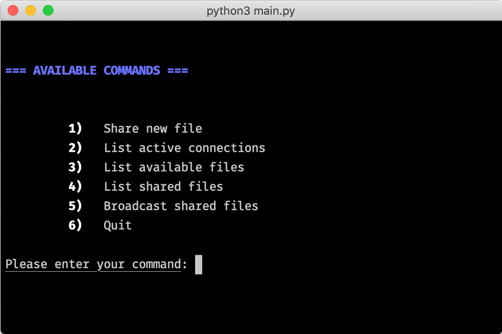

# CmpE 487 Workshop 4
## Torrent File Sharing App

### Usage
```bash
    $ python3 main.py
```



### Contributors:
- [Abdullah Emirhan Karagül](https://github.com/emir350z)
- [Mustafa Enes Çakır](https://github.com/EnesCakir)
- [M. Hakan Kurtoğlu](https://github.com/memhak)

### License
Torrent File Sharing App is an open-sourced software licensed under the [BSD-2 license](https://opensource.org/licenses/BSD-2-Clause).
